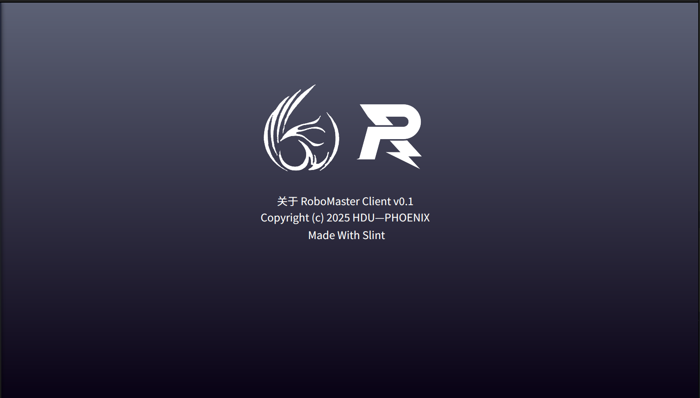

# RoboMaster Phoenix Custom Client(开发ing)



---

## 📋 项目简介

RoboMaster Phoenix Custom Client 是一个基于 **[Slint](https://github.com/slint-ui/slint)** 框架开发的跨平台图形化自定义客户端，用于控制和监测 RoboMaster 机器人。该项目采用现代化的 UI 设计，提供直观的用户界面和高效的通信接口。

## 🏗️ 项目结构

```
Robomaster_Phoenix_Custom_Client/
├── CMakeLists.txt           # CMake 配置文件
├── README.md                # 项目文档
├── ui/                      # Slint UI 文件
│   ├── app-window.slint     # 主窗口
│   ├── main_menu.slint      # 主菜单
│   ├── side_bar.slint       # 侧边栏导航
│   ├── tab_view.slint       # 标签页视图
│   ├── page_dashboard.slint # 仪表盘页面
│   ├── page_setting.slint   # 设置页面
│   ├── page_about.slint     # 关于页面
│   ├── callback_factory.slint # 全局回调接口
│   └── images/              # UI 资源文件
├── src/                     # C++ 源代码
│   ├── main.cpp             # 程序入口
│   ├── callback_center.cpp  # 回调处理
│   └── ...
├── include/                 # C++ 头文件
│   ├── callback_center.hpp
│   └── ...
└── build/                   # 编译输出目录
```

##  项目依赖


[Slint 1.14.1](https://github.com/slint-ui/slint)  
OpenCV  
SDL2   
[Eclipse Paho MQTT](https://github.com/eclipse-paho/paho.mqtt.cpp)  
[Protobuf](https://github.com/protocolbuffers/protobuf/)

## 🚀 快速开始

**Debain/Ubuntu**

```sh
# 依赖安装
sudo apt install qt6-base-dev
# 其实不推荐使用 release 预编译二进制文件安装,qt后端疑似有点问题，建议自行编译安装 slint
sudo bash ./scripts/setup.bash
```

```sh
# 克隆项目
git clone https://github.com/SillyBeee/Robomaster_Phoenix_Custom_Client
cd Robomaster_Phoenix_Custom_Client

# 编译
mkdir build
cd build
cmake ..
make

# 运行程序
./RM_Client
```

## 🛠️ 开发指南

### 项目架构

```
┌─────────────────┐
│   Slint UI      │  (ui/*.slint)
├─────────────────┤
│  Global Logic   │  (callback_factory.slint)
├─────────────────┤
│  C++ Backend    │  (src/*.cpp)
├─────────────────┤
│  System Layer   │  (Linux/Windows/macOS)
└─────────────────┘
```


## 📄 许可证

This application uses Slint, licensed under the Slint [Royalty-Free License](https://github.com/slint-ui/slint/blob/master/LICENSES/LicenseRef-Slint-Royalty-free-2.0.md).

本项目采用 GPLv3 许可证。详见 [LICENSE](LICENSE) 文件。

## 👥 贡献指南

欢迎提交 Issue 和 Pull Request！

---

**Made With ❤️ and Slint**